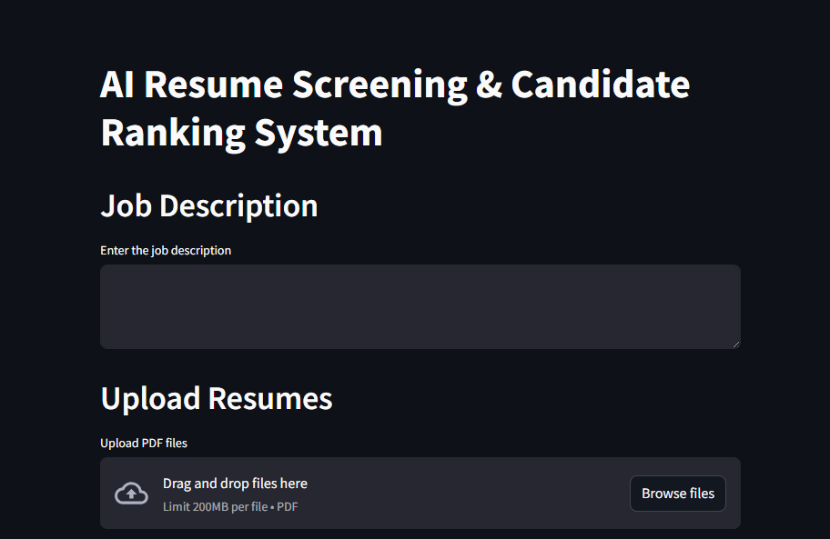
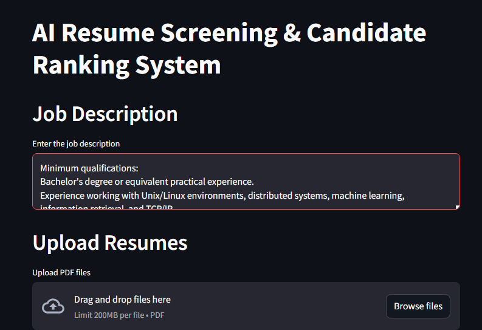
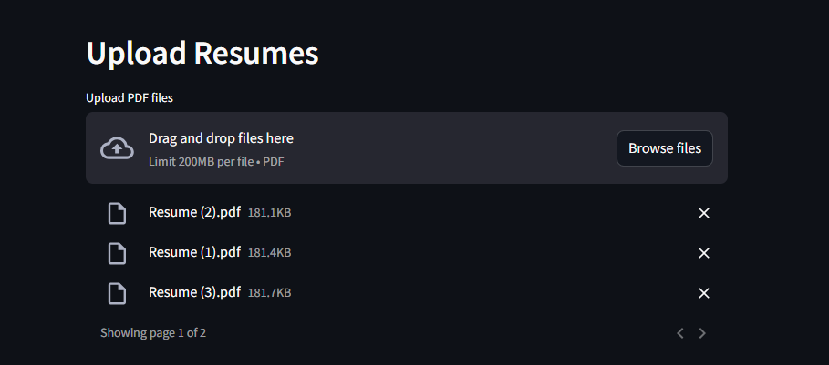
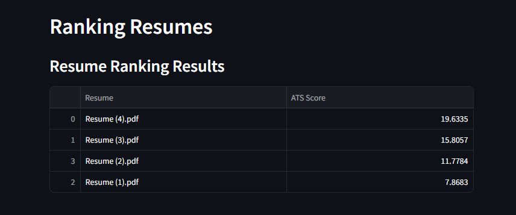
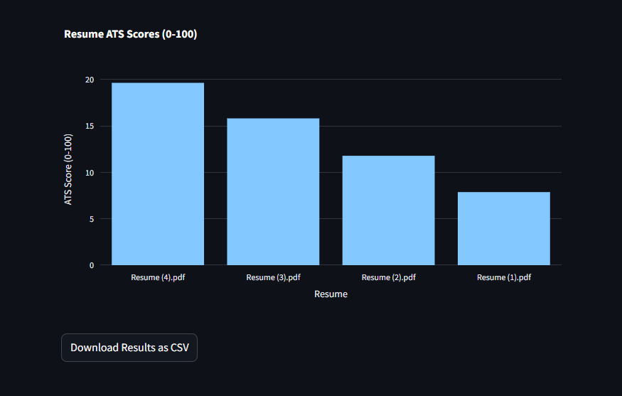

# AI Resume Screening & Candidate Ranking System

This project is an AI-powered resume screening and candidate ranking system that evaluates how well resumes align with a given job description. It leverages modern Natural Language Processing techniques using Sentence Transformers to generate semantic embeddings and calculates cosine similarity to produce an "ATS Score" (Applicant Tracking System Score) on a 0–100 scale. Unlike traditional normalization methods, the ATS Score is calculated directly by multiplying the cosine similarity by 100, giving an absolute measure of alignment.

## Features

- **Semantic Matching:** Uses the `all-MiniLM-L6-v2` model from Sentence Transformers to generate embeddings.
- **Absolute ATS Scoring:** Each resume's alignment with the job description is measured via cosine similarity, which is then multiplied by 100 to produce an intuitive score.
- **PDF Resume Parsing:** Extracts text from PDF resumes using PyPDF2.
- **Interactive Dashboard:** Built with Streamlit for a real-time, interactive user experience.
- **Results Visualization:** Displays resume ranking and a corresponding bar chart via Plotly.
- **CSV Export:** Allows easy export of ranking results as a CSV file.

## Screenshots

### Main Dashboard

### Job Description Input

### Resume Upload

### Resume Ranking Results

### ATS Score Visualization

